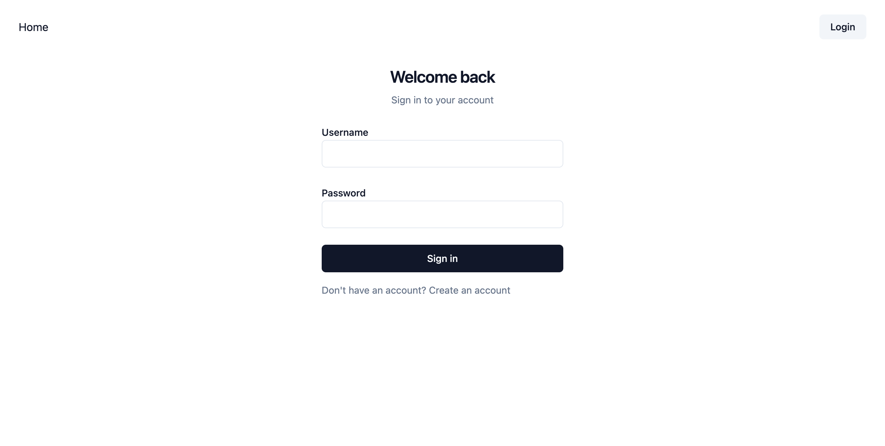

# Astro + Lucia Auth + Neon Serverless Postgres with Prisma + shadcn/ui

This starter uses the Astro StarterKit set up with [Lucia Auth](https://lucia-auth.com/), Prisma with [Neon Postgres](https://neon.tech) as the database, and Tailwind with [shadcn/ui](https://ui.shadcn.com/). The database can be used for queries and data fetching outside of the Auth mechanisms too.



The [serverless driver](https://github.com/neondatabase/serverless) is used for Neon Postgres. This is integrated with Prisma via the `previewFeatures = ["driverAdapters"]` in the `schema.prisma` file. The Prisma Client setup is located in `./lib/prisma.ts`.

```ts
import { Pool, neonConfig } from "@neondatabase/serverless";
import { PrismaNeon } from "@prisma/adapter-neon";
import { PrismaClient } from "@prisma/client";
import dotenv from "dotenv";
import ws from "ws";

dotenv.config();
neonConfig.webSocketConstructor = ws;
const connectionString = `${process.env.DATABASE_URL}`;

const pool = new Pool({ connectionString });
const adapter = new PrismaNeon(pool);

let sql = (global as any).sql || new PrismaClient({ adapter });

if (process.env.NODE_ENV === "development") (global as any).sql = sql;

export default sql;
```

<small>Reference: [Connect from Prisma to Neon](https://neon.tech/docs/guides/prisma)</small>

## Project Structure

Inside of your Astro project, you'll see the following folders and files:

```diff
/
+ ├── lib/
+ │   ├── lucia.ts
+ │   └── prisma.ts
+ ├── prisma/
+ │   └── schema.prisma
  ├── public/
  │   └── favicon.svg
  ├── src/
  │   ├── components/
  │   │   └── Card.astro
  │   ├── layouts/
  │   │   └── Layout.astro
  │   └── pages/
  │       ├── api/
+ │       │   ├── logout.ts
+ │       │   └── hello-protected.ts
+ │       ├── middleware.ts
+ │       ├── login.astro
+ │       ├── signup.astro
  │       └── index.astro
  └── package.json
```

### Protected API Route

The `/api/hello-protected` API route is an example of using restricting API access with Auth.

## Getting Started

1. Install the dependencies:

```
pnpm install
```

2. Add your Neon Postgres database URL as an Environment Variable

```
DATABASE_URL="<>"
```

3. Generate the Prisma Client

```
npx prisma generate
```

4. Push the schema to your database. Now, the table structure is reflected in your Neon database.

```
npx prisma db push
```

5. Run the server

```
pnpm dev
```

## A Postgres Database Branch for each environment

To use a different database branch for each environment (dev / prod). Create a corresponding environment variable dotenv file (`.env.development` or `.env.production`) with the database branch connection URL.

An example of this architecture is below. The Neon Project has a database (1 or more) and each branch is derived from that database. Each one of those branches maps to the development environment for the app.

```mermaid

graph TD
    subgraph neon_project [Project]

        subgraph neon_db [Neon Database]
            dev_db[Database: Dev Branch]
            test_db[Database: Test Branch]
            prod_db[Database: Prod Branch]
        end
    end

    subgraph dev [Development]
        dev_git[Git: Dev Branch]
        dev_subdomain[Subdomain: dev.example.com]
    end

    subgraph test [Testing]
        test_git[Git: Test Branch]
        test_subdomain[Subdomain: test.example.com]
    end

    subgraph prod [Production]
        prod_git[Git: Prod Branch]
        prod_subdomain[Subdomain: example.com]
    end

    dev_db --> dev_git
    dev_git --> dev_subdomain
    dev_db -.-> test_db

    test_db --> test_git
    test_git --> test_subdomain
    test_db -.-> prod_db

    prod_db --> prod_git
    prod_git --> prod_subdomain

```
